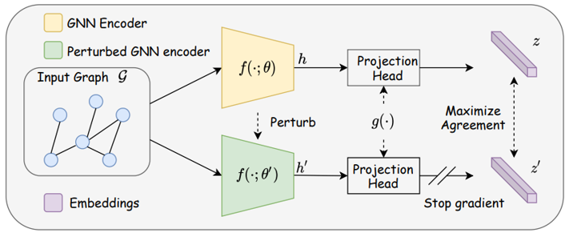

# SimGRACE: A Simple Framework for Graph Contrastive Learning without Data Augmentation
PyTorch implementation for [SimGRACE: A Simple Framework for Graph Contrastive Learning without Data Augmentation](https://arxiv.org/pdf/2202.03104.pdf) accepted by The Web Conference 2022 (WWW 2022).
## Overview
In this repository, we provide the codes of SimGRACE to evaluate its performances in terms of generalizability (unsupervised & semi-supervised learning), transferability (transfer learning) and robustness (adversarial robustness).

## Dataset download
* Semi-supervised learning & Unsupervised representation learning [[TU Datasets]](https://chrsmrrs.github.io/datasets/docs/datasets/) (social and biochemical graphs)
* Transfer learning [[chem data]](http://snap.stanford.edu/gnn-pretrain/data/chem_dataset.zip) (2.5GB);[[bio data]](http://snap.stanford.edu/gnn-pretrain/data/bio_dataset.zip) (2GB) 
* Adversarial robustness [[synthetic data]](https://www.dropbox.com/sh/mu8odkd36x54rl3/AABg8ABiMqwcMEM5qKIY97nla?dl=0)

## Citation
```
@inproceedings{xia2022SimGRACE,
 author = {Xia, Jun and Wu, Lirong and Chen, Jintao and Hu, Bozhen and Li, Stan Z.},
 booktitle = {The Web Conference},
 title = {SimGRACE: A Simple Framework for Graph Contrastive Learning without Data Augmentation},
 year = {2022}
}
```
## Useful resources for Pretrained Graphs Models (PGMs)
* The first comprehensive survey for PGMs: [[A Survey of Pretraining on Graphs: Taxonomy, Methods, and Applications]](https://arxiv.org/abs/2202.07893v1)
* [[A curated list of must-read papers, open-source pretrained models and pretraining datasets.]](https://github.com/junxia97/awesome-pretrain-on-graphs)

## Reference
1.  [Graph Contrastive Learning Automated (ICML 2021)](https://github.com/Shen-Lab/GraphCL_Automated)
2.  [Graph Contrastive Learning with Augmentations (NeurIPS 2020)](https://github.com/Shen-Lab/GraphCL)
3.  [Strategies for Pre-training Graph Neural Networks (ICLR 2020)](https://github.com/snap-stanford/pretrain-gnns/)
4.  [Adversarial Attack on Graph Structured Data (ICML 2018)](https://github.com/Hanjun-Dai/graph_adversarial_attack)
